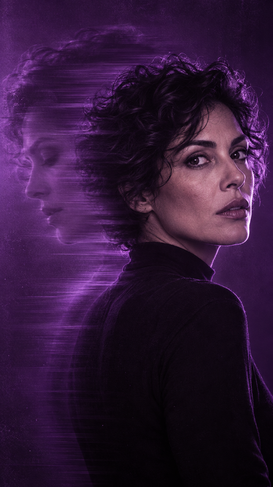
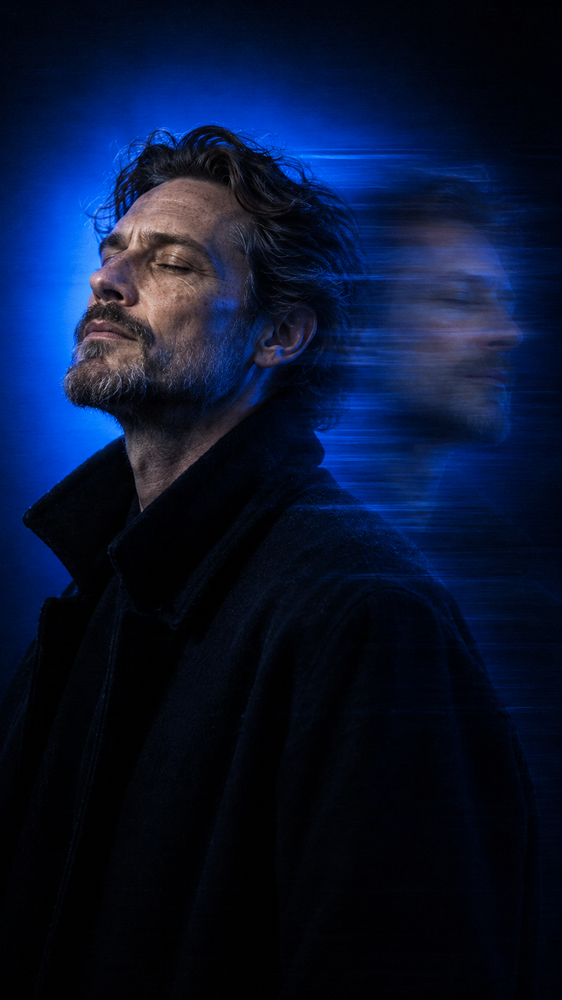

# Motion Echo Portraits

 |  |  | 

**[Português](README.md) · [English](README.en.md) · [Español](README.es.md)**

Guia aberto de retratos com eco de movimento: referência, quatro direções neon, prompts originais, revisão e prática de uma série editorial.

[Guia de uso](https://inematds.github.io/motion-echo-portraits/guia/)

Abra `guia/index.html` no navegador para leitura local. Copiar prompts funciona em HTTPS ou localhost; quando indisponível, o texto é selecionado para cópia manual. Anotações e tema usam armazenamento local do navegador.

O site é estático e não envia fotos nem chama geradores. Os quatro prompts originais em inglês foram fornecidos pelo usuário a partir do guia AVCC · AI Video Creators. As explicações e exercícios são complementos INEMA. Ainda não foram testados por geração nesta entrega.

Versão: 1.1.0.

## Curso v6

[Curso v6](https://inematds.github.io/motion-echo-portraits/landing.html) · 4 aulas práticas.
